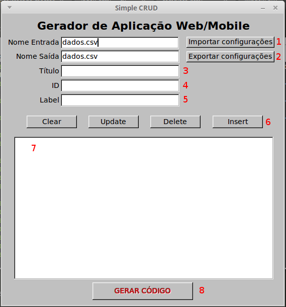

# Trabalho 8: Gerador em C++ de Aplicação Web/Mobile em HTML5/Javascript

## Compilando
Basta executar o arquivo [compile.sh](compile.sh) e depois rodar o arquivo [a.out](a.out) gerado. Após isso adicione os campos e abra o arquivo [index.html](index.html) no navegador de sua preferência.

## Manual da Interface gráfica

 1. Por padrão, o programa salvo os dados no arquivo [dados.csv](dados.csv), porém pode salvar em outro arquivo, só precisa mudar o nome na caixa de texto. **ATENÇÃO: O programa foi testado apenas com arquivos .csv, então certifique-se de colocar esta extensão no final do nome, qualquer outra formato fica por conta e risco do usuário.**
 1. Da mesma forma que em *1*, os dados podem ser salvos em outro arquivo, mas deve-se respeitar os mesmos avisos.
 1. Título da aplicação.
 1. Id do campo que se deseja criar.
 1. Label do campo que se deseja criar.
 1. Botões para limpar os campos anteriores, atualizar um dado no *7*, deletar um dado do *7* e criar um dado no *7*.
 1. Espaço onde os dados criados anteriormente são mostrados.
 1. Botão que gera o código html que é salvo no arquivo [index.html](index.html).
